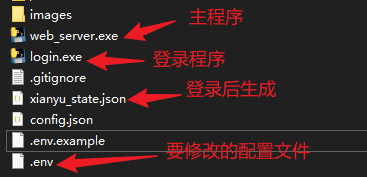

# 闲鱼智能监控机器人-win一键启动
- 本项目主要为了方便小白用户无门槛一键启动，其他技术大牛建议直接看原作者项目。
- 本项目基于[ai-goofish-monitor](https://github.com/Usagi-org/ai-goofish-monitor)源码二次开发，使用pyinstaller打包成windows可执行文件
- 一个基于 Playwright 和AI过滤分析的闲鱼(goofish)多任务实时监控与智能分析工具，配备了功能完善的 Web 管理界面。

## ✨ 修改内容

- **支持打包成exe**: 修改支持打包成单个exe运行文件，方便小白用户直接使用
- **支持定位和地区筛选**: 增加配置支持设置定位和地区，设置后自动筛选该定位和地区下的商品

## 页面截图

**后台任务管理**

**后台监控截图**

## 🚀 快速开始

### 第 1 步: 环境准备

克隆本项目到本地，打开bin目录

### 第 2 步: 基础配置

1. **配置环境变量**: 复制`.env.example`文件并命名为`.env`，并修改里面的内容。

    `.env` 文件中的常用配置项如下（其他配置请查阅[ai-goofish-monitor](https://github.com/Usagi-org/ai-goofish-monitor)）：

    | 环境变量 | 说明                         | 是否必填 | 注意事项                                                                 |
    | :--- |:---------------------------| :--- |:---------------------------------------------------------------------|
    | `OPENAI_API_KEY` | 你的AI模型服务商提供的API Key。       | 是 | 对于某些本地或特定代理的服务，此项可能为可选。                                              |
    | `OPENAI_BASE_URL` | AI模型的API接口地址，必须兼容OpenAI格式。 | 是 | 请填写API的基础路径，例如 `https://dashscope.aliyuncs.com/compatible-mode/v1/`。 |
    | `OPENAI_MODEL_NAME` | 你要使用的具体模型名称。               | 是 | **必须**选择一个支持图片分析的多模态模型，如 `doubao-seed-1-6-250615`, `qwen-vl-plus` 等。 |  
    | `SERVER_PORT` | Web UI服务的运行端口。             | 否 | 默认为 `8000`。                                                          |
    | `LATITUDE` | 筛选城市的纬度                    | 否 | 【新增参数】不需要筛选地区则不填，需求打开浏览器的定位权限。                                       |
    | `LONGITUDE` | 筛选城市的经度                    | 否 | 【新增参数】                                                               |
    | `AREA_TEXT` | 要筛选的地区                     | 否 | 【新增参数】不需要筛选地区则不填。                                                    |

2. **获取登录状态 (重要!)**: 为了让爬虫能够以登录状态访问闲鱼，必须先提供有效的登录凭证。
    - **双击运行login.exe程序**
    - 运行后会弹出一个浏览器窗口，请使用**手机闲鱼App扫描二维码**完成登录。成功后，程序会自动关闭，并在项目根目录生成一个 `xianyu_state.json` 文件。

### 第 3 步: 启动 Web 服务

一切就绪后，**双击web_server.exe程序**，启动 Web 管理后台服务器。

### 第 4 步: 开始使用

在浏览器中打开 `http://127.0.0.1:8000` 访问管理后台。

1. 登录系统
- 用户名：`admin`
- 密码：`admin123`
2. 在 **“任务管理”** 页面，点击 **“创建新任务”**。
3. 在弹出的窗口中，用自然语言描述你的购买需求（例如：“我想买一台95新以上的索尼A7M4相机，预算1万3以内，快门数低于5000”），并填写任务名称、关键词等信息。
4. 点击创建，AI将自动为你生成一套复杂的分析标准。
5. 回到主界面，为任务添加定时或直接点击启动，开始自动化监控！

## 致谢

本项目基于以下开源优秀项目修改，特此感谢：

- [ai-goofish-monitor](https://github.com/Usagi-org/ai-goofish-monitor)

## ⚠️ 注意事项

- 请遵守闲鱼的用户协议和robots.txt规则，不要进行过于频繁的请求，以免对服务器造成负担或导致账号被限制。
- 本项目仅供学习和技术研究使用，请勿用于非法用途。
- 本项目采用 [MIT 许可证](LICENSE) 发布，按"现状"提供，不提供任何形式的担保。
- 项目作者及贡献者不对因使用本软件而导致的任何直接、间接、附带或特殊的损害或损失承担责任。
- 如需了解更多详细信息，请查看 [免责声明](DISCLAIMER.md) 文件。

## 📫 联系方式
如有任何问题，请扫码私信留言，看到会尽快回复

